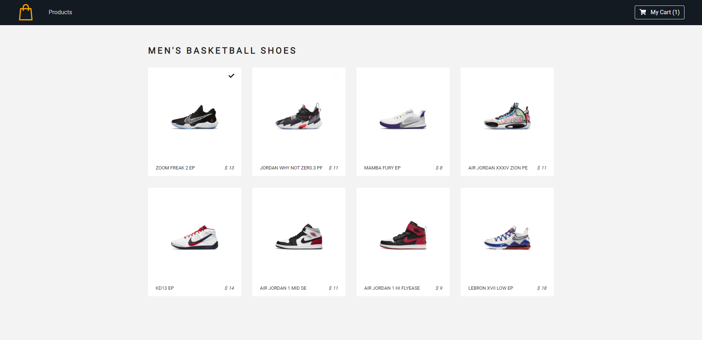
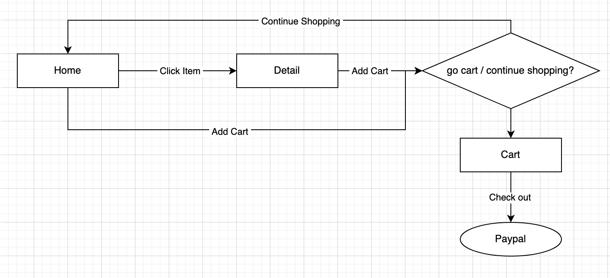
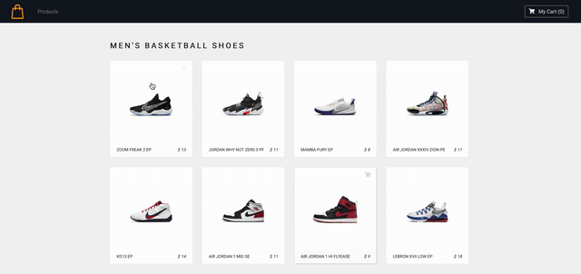
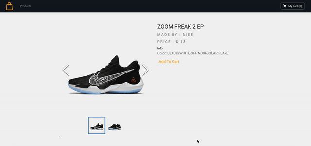
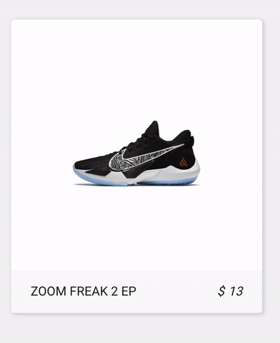
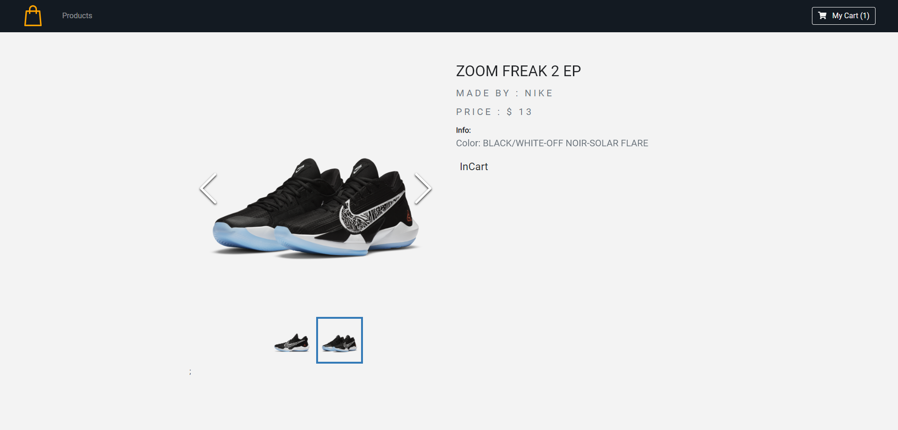
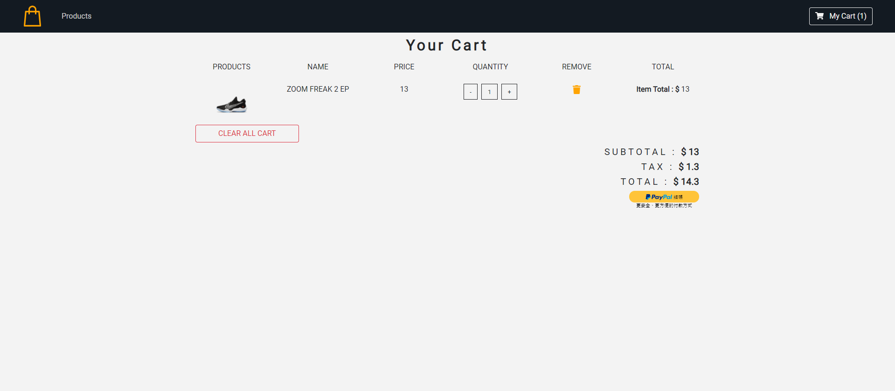
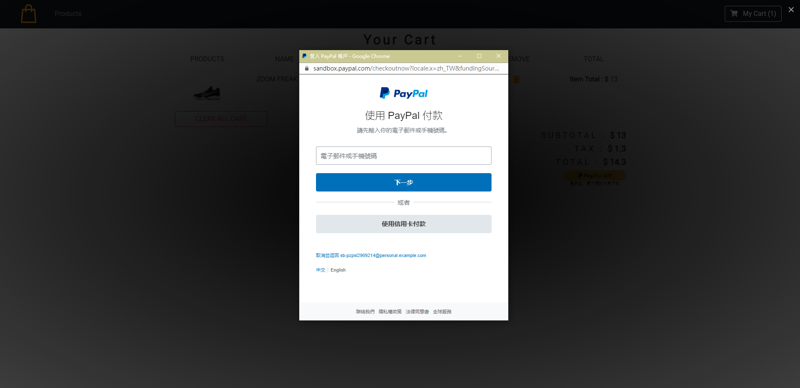

## Table of Content
1. [Project Information](#appinfo)
2. [Technologies](#technologies)
3. [Design](#design)
4. [Features](#features)
5. [Installation](#installation)

<a name="appinfo"></a>
## Project Information
Demo : https://shopping-store-demo.netlify.app/ <br>
*** In the demo the Paypal function is disabled. *** <br><br>
The app is to show how item list and shopping cart work. Also it integrates with payment function (Paypal). <br>
There is pure front-end project without back-end server and DB. <br>
<br>

<a name="technologies"></a>
## Technologies
- React 
- Context
- Styled-components
- Higher-order component
- React-router-dom

<a name="design"></a>
## Design


<a name="features"></a>
## Features
### Add item to the cart
 <br>
 <br>

### Item animation
 <br>

### Image Gallary


### Paypal redirect
 <br>


<a name="installation"></a>
## Installation
```
npm install
npm start
```
